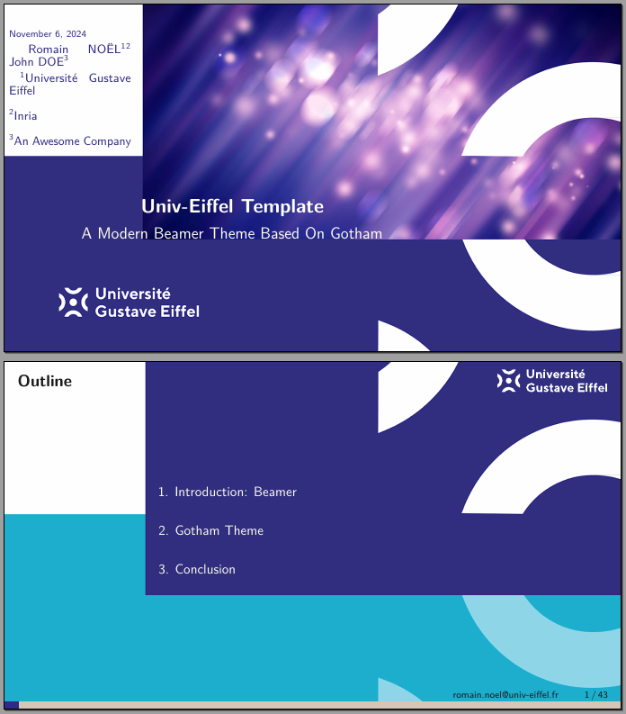
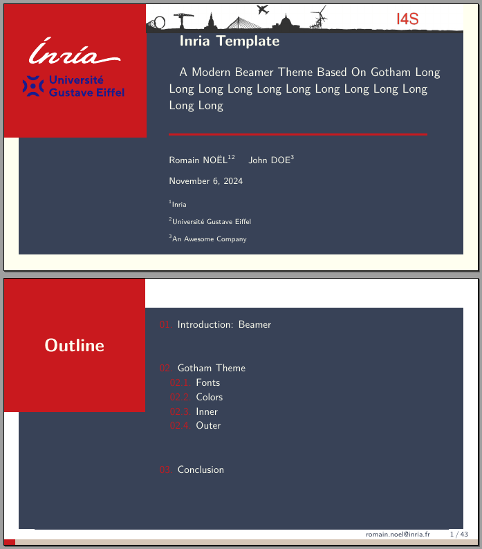

# A Beamer template for UGE/Inria/CEA

## Why this repository ?
Since we are often working with different institutions, we have to switch between our their templates regularly, which is not always an easy task.

## What is it ?
The purpose of this LaTeX/Beamer theme is to provide a template for presentations at Université Gustave Eiffel or Inria or CEA.

## How to use/install
There is two major ways to use this template: downloading from Git or "make a copy" from Overleaf.

- Github link: https://github.com/Universite-Gustave-Eiffel/beamer-template_uge-inria

  If you have a LaTeX distribution installed on your computer, you can download the sources by clicking on `<> Code`/`Download ZIP`.
  After extracting the sources, you can directly edit (and probably rename) the file `ready2Go.tex`.
  Then, you can compile your presentation using your favorite LaTeX compiler (pdflatex, xelatex, luatex, arara, latexmk...).
  If you use the `glossaires` package (or some others) as given in the example, do not forget to add the compilation option `--shell-escape`.
  This remark stands also for your favorite LaTeX IDE (~~VSCode~~ Codium, TeXStudio, TeXMaker, Lyx, Emacs, ...)
  Compilation command example: `pdflatex output.pdf ready2Go.tex --shell-escape`.

- Overleaf link (read only): https://www.overleaf.com/read/vxnjgfmyvccj

  If you do not want to install a LaTeX distribution or just want to try first, on Overleaf you can click on `Make a copy` (or `copy project`, according to where you are).
  This copy will be editable so you will be able to play around. 

## Demonstration files
- **ready2Go**: 
- **UGE official**: 
- **UGE unofficial light**: 
- **UGE unofficial dark**: 
- **Inria old style**: 
- **Inria RF style**: 
- **CEA example**: 

## How to contribute
- raising [issues](https://github.com/Universite-Gustave-Eiffel/beamer-template_uge-inria/issues) on git
- giving stars on git
- buying us a coffee
- mailing us 
